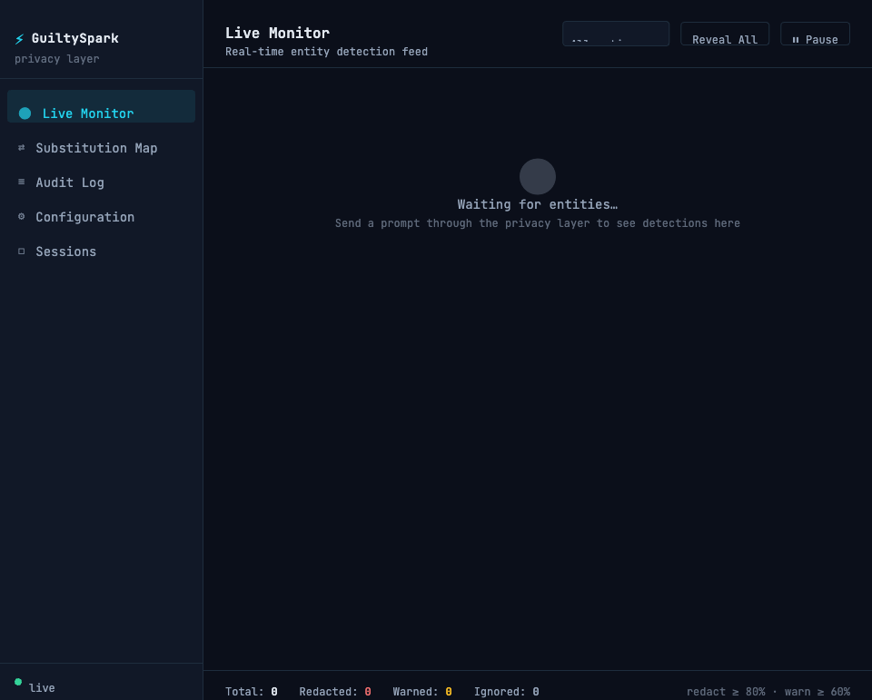

# GuiltySpark

> *"I am a genius."* — 343 Guilty Spark, faithfully indexing everything it was told to protect.

GuiltySpark is a local privacy layer that sits between you and LLM providers (Anthropic, OpenAI, etc.). It intercepts your prompts, detects and replaces sensitive data with realistic-looking synthetic substitutes before the request leaves your machine, sends the sanitized prompt to the LLM, then decodes the response back — restoring all substituted values before returning the result to you.

All detection and classification runs locally via [Ollama](https://ollama.ai). Your sensitive data never leaves your machine.

---

## Dashboard

GuiltySpark ships with a local web dashboard for real-time visibility into what the privacy layer is doing. It runs alongside the proxy and requires no external services.

```bash
npm run dev:dashboard
# Dashboard available at http://localhost:8788
```

### Pages

| Page | Description |
|---|---|
| **Live Monitor** | Live feed of intercepted requests and responses, showing PII hits, substitutions applied, and round-trip latency |
| **Substitution Map** | Inspect the active substitution table for each session — original values, synthetic replacements, and entity types |
| **Audit Log** | Searchable, filterable log of all sessions with timestamps, entity counts, and substitution summaries |
| **Configuration** | Edit `guiltyspark.config.yaml` settings from the UI: enabled entity types, substitution modes, Ollama model selection |
| **Sessions** | Manage active proxy sessions, view per-session stats, and manually expire session state |

### Screenshots

**Live Monitor**



**Configuration**


> Screenshots can be generated by running `npm run dev:dashboard` and navigating to `http://localhost:8788`.

---

## Table of Contents

- [Dashboard](#dashboard)
- [Why GuiltySpark?](#why-guiltyspark)
- [Core Capabilities](#core-capabilities)
- [Detailed Architecture](#detailed-architecture)
  - [System Components](#system-components)
  - [PII Detection Pipeline](#pii-detection-pipeline)
  - [Substitution Engine](#substitution-engine)
  - [Interception Layer](#interception-layer)
  - [Preserving LLM Performance](#preserving-llm-performance)
- [Process Flow](#process-flow)
  - [Complete Request Flow](#complete-request-flow)
  - [PII Detection Detail](#pii-detection-detail)
  - [Substitution Map Lifecycle](#substitution-map-lifecycle)
- [Pros and Cons](#pros-and-cons)
  - [Strengths](#strengths)
  - [Weaknesses and Failure Modes](#weaknesses-and-failure-modes)
  - [Edge Cases](#edge-cases)
- [Potential Architectures](#potential-architectures)
  - [Architecture A: MCP Server](#architecture-a-mcp-server)
  - [Architecture B: Local HTTP Proxy](#architecture-b-local-http-proxy)
  - [Architecture C: SDK Wrapper](#architecture-c-sdk-wrapper)
  - [Architecture Comparison](#architecture-comparison)
- [Tech Stack](#tech-stack)
- [Privacy Guarantees](#privacy-guarantees)
- [Configuration](#configuration)
- [Threat Model](#threat-model)
- [Project Status](#project-status)

---

## Why GuiltySpark?

LLMs are powerful reasoning engines, but using them means routing your data through third-party APIs. For many real-world tasks — drafting emails, analyzing contracts, summarizing documents, writing code against internal systems — prompts naturally contain:

- Names, emails, phone numbers, physical addresses
- Account numbers, SSNs, credit card numbers
- API keys, passwords, secrets
- Internal company names, project codenames, IP addresses
- Medical or legal information
- Anything else you'd rather not log on someone else's server

Most users either avoid LLMs for sensitive work or paste in the data and hope for the best. GuiltySpark makes a third option viable: use LLMs with full capability on sensitive content, while keeping that content local.

---

## Core Capabilities

### PII Detection via Local Ollama Models

GuiltySpark uses a locally-running Ollama model to detect and classify sensitive entities in your prompt before it goes anywhere. Because detection runs on-device, no data is exfiltrated during analysis — not even the metadata about what was found.

Supported entity categories (configurable):

| Category | Examples |
|---|---|
| `PERSON_NAME` | "John Smith", "Dr. Martinez" |
| `EMAIL` | "john@example.com" |
| `PHONE` | "+1-555-867-5309" |
| `ADDRESS` | "123 Main St, Springfield, IL" |
| `SSN` | "123-45-6789" |
| `CREDIT_CARD` | "4111 1111 1111 1111" |
| `API_KEY` | "sk-...", "Bearer eyJ..." |
| `IP_ADDRESS` | "192.168.1.100" |
| `DATE_OF_BIRTH` | "born January 15, 1980" |
| `COMPANY_INTERNAL` | User-defined sensitive org names |
| `CUSTOM` | User-defined regex or semantic rules |

### Variable Substitution Engine

Detected entities are replaced with realistic synthetic equivalents — not generic tokens. The substitution map is held in memory for the duration of the session:

```
Original:   "Draft an NDA between Acme Corp and John Smith (john@acme.com)."
Sanitized:  "Draft an NDA between Meridian Solutions and Robert Chen (r.chen@meridiansolutions.com)."
```

Internally, the substitution map tracks both the synthetic value and the original:

```json
{
  "Acme Corp":    { "type": "COMPANY", "synthetic": "Meridian Solutions",  "id": "COMPANY_0" },
  "John Smith":   { "type": "PERSON",  "synthetic": "Robert Chen",         "id": "PERSON_0"  },
  "john@acme.com":{ "type": "EMAIL",   "synthetic": "r.chen@meridiansolutions.com", "id": "EMAIL_0" }
}
```

Substitutions are:
- **Type-aware** — names replaced with names, companies with companies, emails with valid emails
- **Consistent within a session** — the same value always maps to the same synthetic, so LLM reasoning stays coherent across multi-turn conversations
- **Format-preserving** — a US phone number maps to another US phone number; a UUID maps to another UUID

### Request Interception and Transformation

GuiltySpark intercepts the outbound request before it reaches the LLM API, transforms the entire message payload (system prompt, user messages, tool results, document attachments), and forwards the sanitized version. The LLM sees only the synthetic data.

### Response Decoding

The LLM's response comes back referencing synthetic values. GuiltySpark runs a reverse substitution pass over the response text, restoring all synthetic identifiers to their original values before returning the response to the user.

```
LLM response:  "Here is a draft NDA between Meridian Solutions and Robert Chen..."
Decoded:       "Here is a draft NDA between Acme Corp and John Smith..."
```

### MCP Server Integration

GuiltySpark exposes itself as an [MCP (Model Context Protocol)](https://modelcontextprotocol.io) server. This means it can plug directly into Claude Desktop, Cursor, or any MCP-compatible client as a tool layer — no proxy configuration or SDK changes required.

### User-Configurable Privacy Rules

Users control what gets protected:

```yaml
# guiltyspark.config.yaml
protect:
  - PERSON_NAME
  - EMAIL
  - PHONE
  - API_KEY
  - custom:
      - pattern: "Project (Nightingale|Falcon|Atlas)"
        label: CODENAME
      - pattern: "\\b10\\.0\\.\\d+\\.\\d+\\b"
        label: INTERNAL_IP

allow:
  - COMPANY_NAME   # you're OK sending your company's name
  - PUBLIC_URL     # public-facing URLs are fine

passthrough_if_local: true   # skip sanitization for local/self-hosted LLMs
```

### Session-Scoped Variable Maps

Variable maps are ephemeral by default — stored only in process memory for the lifetime of the session and discarded on exit. No substitution history is written to disk unless the user explicitly opts in.

---

## Detailed Architecture

### System Components

GuiltySpark is composed of five primary modules. Each has a single responsibility and communicates with adjacent modules through well-defined interfaces.

```
┌──────────────────────────────────────────────────────────────────────┐
│                          GuiltySpark Process                         │
│                                                                      │
│  ┌─────────────┐    ┌──────────────┐    ┌──────────────────────┐   │
│  │  Intercept  │───▶│  PII Scanner │───▶│  Substitution Engine │   │
│  │   Layer     │    │  (Ollama NER)│    │  (EntityMap + Faker) │   │
│  └──────┬──────┘    └──────────────┘    └──────────┬───────────┘   │
│         │                                           │               │
│         │           ┌──────────────┐               │               │
│         └──────────▶│  LLM Relay   │◀──────────────┘               │
│                     │  (Provider   │                                │
│                     │   Clients)   │                                │
│                     └──────┬───────┘                                │
│                            │                                        │
│                     ┌──────▼───────┐                                │
│                     │   Response   │                                │
│                     │   Decoder    │                                │
│                     └──────────────┘                                │
└──────────────────────────────────────────────────────────────────────┘
```

#### 1. Intercept Layer

**Responsibility:** Accept inbound requests from the user's client (MCP, proxy, or SDK), extract all text content from the message payload, dispatch it to the PII Scanner, receive the substitution map back, apply substitutions to the payload, and forward the sanitized payload to the LLM Relay.

**Interfaces:**
- *Inbound:* MCP protocol (stdio/SSE), HTTP proxy CONNECT, or in-process SDK call
- *Outbound to Scanner:* `ScanRequest { text: string[], config: ProtectionConfig }`
- *Outbound to Relay:* sanitized message payload (same shape as original, provider-specific)
- *Inbound from Relay:* raw LLM response (provider-specific)
- *Outbound to Decoder:* `DecodeRequest { text: string, sessionMap: SubstitutionMap }`
- *Final outbound:* decoded response, returned to original caller

The Intercept Layer owns the session lifecycle. It creates a session on the first request, maintains the `SubstitutionMap` across conversation turns, and tears it down on session close or timeout.

#### 2. PII Scanner

**Responsibility:** Detect and classify sensitive entities in a body of text. Return a list of `DetectedEntity` records — each with its original span, entity type, confidence score, and position in the source string.

**Interfaces:**
- *Inbound:* `ScanRequest { text: string[], config: ProtectionConfig }`
- *Outbound:* `ScanResult { entities: DetectedEntity[], durationMs: number }`

```typescript
interface DetectedEntity {
  original:   string;          // exact matched text
  type:       EntityType;      // PERSON_NAME | EMAIL | PHONE | ...
  confidence: number;          // 0.0 – 1.0
  start:      number;          // character offset in source text
  end:        number;
  source:     'llm' | 'regex'; // which detection path found it
}
```

The Scanner combines two detection paths (described in detail below): an Ollama LLM pass and a regex/rule pass. Results are merged and deduped, with overlapping spans resolved by taking the higher-confidence match.

#### 3. Substitution Engine

**Responsibility:** Given a set of `DetectedEntity` records, produce or look up realistic synthetic replacements and update the session's `SubstitutionMap`. Handle all the nuances of format preservation, grammatical context, and consistency.

**Interfaces:**
- *Inbound:* `SubstituteRequest { entities: DetectedEntity[], sessionMap: SubstitutionMap }`
- *Outbound:* `SubstitutionMap` (updated), `AppliedSubstitutions[]`

The Engine uses a deterministic faker seeded from a session-specific random seed. The same session always produces the same synthetic values for the same originals. Different sessions produce different synthetics, so cross-session correlation is prevented.

#### 4. LLM Relay

**Responsibility:** Accept a sanitized message payload and forward it to the appropriate LLM provider API. Handle authentication, retry logic, and response streaming. Return the raw LLM response to the caller.

**Interfaces:**
- *Inbound:* sanitized message payload + provider config
- *Outbound:* raw LLM response (streaming or non-streaming)

The Relay is intentionally thin. It does not inspect or modify content — that is the Intercept Layer's job. It exists to decouple provider-specific API shapes from the rest of the system.

#### 5. Response Decoder

**Responsibility:** Given an LLM response (which may reference synthetic values) and the session's `SubstitutionMap`, perform a reverse substitution pass to restore original values. Return the decoded response.

**Interfaces:**
- *Inbound:* `DecodeRequest { text: string, sessionMap: SubstitutionMap }`
- *Outbound:* decoded response string

Decoding is a straightforward string replacement, but must handle:
- Partial matches (e.g., the LLM using "Chen" when the synthetic was "Robert Chen")
- Case variations introduced by the LLM ("ROBERT CHEN" in a heading)
- Possessive and other morphological forms ("Chen's proposal" → "Smith's proposal")
- The LLM echoing back a modified version of the synthetic (abbreviations, nicknames)

---

### PII Detection Pipeline

The PII Scanner uses a two-stage pipeline: a fast regex/rule scan followed by an LLM-based NER pass. Results are merged.

#### Stage 1: Regex and Rule-Based Detection

The first pass runs synchronously and has zero network overhead. It covers high-precision, deterministic entity patterns:

| Rule | Pattern | Precision | Recall |
|---|---|---|---|
| Email | RFC 5321 compliant regex | Very high | Very high |
| US Phone | `\b(\+1[-.\s]?)?\(?\d{3}\)?[-.\s]\d{3}[-.\s]\d{4}\b` | High | High |
| SSN | `\b\d{3}-\d{2}-\d{4}\b` | High | Medium (ambiguous with other numbers) |
| Credit card | Luhn-validated 13–19 digit patterns | Very high | High |
| IP address | `\b\d{1,3}\.\d{1,3}\.\d{1,3}\.\d{1,3}\b` | High | High |
| API key | Common prefixes: `sk-`, `Bearer `, `ghp_`, `AKIA` | High | Medium |
| UUID | Standard UUID format | Very high | Very high |
| JWT | `eyJ[A-Za-z0-9_-]+\.[A-Za-z0-9_-]+\.[A-Za-z0-9_-]*` | Very high | Very high |
| User-defined | Config-supplied regex patterns | Varies | Varies |

Regex-matched entities get `confidence: 0.95` by default (high but not 1.0, since regex can have false positives in some edge cases like SSNs appearing as date-like strings).

#### Stage 2: LLM-Based NER (Ollama)

The second pass sends the text to a local Ollama model with a structured NER prompt. This catches entities that require semantic understanding — names, company names, addresses, contextual dates of birth — that cannot be reliably captured by regex.

**Prompt structure:**

```
You are a Named Entity Recognition system. Extract all sensitive entities from the following text.

For each entity, output a JSON object with these fields:
- "text": the exact matched string as it appears in the source
- "type": one of: PERSON_NAME, EMAIL, PHONE, ADDRESS, SSN, CREDIT_CARD, API_KEY,
          IP_ADDRESS, DATE_OF_BIRTH, COMPANY_INTERNAL, FINANCIAL_ACCOUNT, MEDICAL_INFO
- "confidence": a float from 0.0 to 1.0 representing your certainty

Only include entities you are genuinely confident about. Output a JSON array.

Text:
"""
{text}
"""
```

The response is parsed as JSON. Malformed or unparseable responses fall back to the regex-only results for that text chunk.

**Model output example:**

```json
[
  { "text": "John Smith",      "type": "PERSON_NAME",  "confidence": 0.97 },
  { "text": "john@acme.com",   "type": "EMAIL",        "confidence": 0.99 },
  { "text": "Acme Corp",       "type": "COMPANY_INTERNAL", "confidence": 0.72 }
]
```

#### Confidence Thresholds

GuiltySpark applies configurable confidence thresholds to decide whether to act on a detection:

| Threshold | Default | Effect |
|---|---|---|
| `redact_above` | 0.80 | Entities at or above this confidence are substituted |
| `warn_between` | 0.60 – 0.80 | Entities in this range trigger a warning to the user but are passed through |
| `ignore_below` | 0.60 | Entities below this threshold are ignored |

Users can tighten these (lower `redact_above`) to be more aggressive, at the cost of more false positives.

#### Chunk Handling for Long Prompts

Long prompts are split into overlapping chunks before being sent to Ollama. The overlap ensures entities that span chunk boundaries are not missed. A 200-token overlap on a 1000-token chunk size works well in practice.

```
┌──────────────┬──────────────┬──────────────┐
│   chunk 0    │   chunk 1    │   chunk 2    │
└──────────────┴──────────────┴──────────────┘
              ◄─200 tok─►◄─200 tok─►
                overlap    overlap
```

After scanning, entity spans are mapped back to the full text's character coordinates and deduped.

#### Ollama Timeout Handling

If Ollama does not respond within `timeout_ms` (default: 2000ms), the Scanner falls back to regex-only results. This prevents slow local hardware from blocking the entire request. A warning is surfaced to the user when this happens, since LLM-detected entities (names, companies) will not be covered.

---

### Substitution Engine

The Substitution Engine is the core of what makes GuiltySpark different from naive redaction tools. Rather than replacing sensitive values with brackets or generic tokens, it generates realistic-looking synthetic equivalents.

#### Why Realistic Substitutions Matter

LLMs are trained on human-written text where names, places, and other entities appear as real values. When a model is asked to draft a contract for "{{PERSON_0}}", several problems arise:

1. **Out-of-distribution inputs.** Generic tokens like `{{PERSON_0}}` or `[NAME_1]` are rare in training data. The model may treat them as template syntax rather than as actual person names, subtly altering its behavior — becoming more formal, more hedged, or producing different stylistic outputs than it would for real names.

2. **Grammar degradation.** Possessives, pronouns, and sentence structure depend on recognizing an entity as a specific type. "John's contract" sanitized to "{{PERSON_0}}'s contract" leaves a syntactically awkward token. A model producing output with `{{PERSON_0}}'s` in it may not handle the apostrophe-s correctly in all contexts.

3. **Reasoning about entity type.** Instructed to "write a formal letter to the client", a model performs better when "the client" has a name it can address, because it can generate "Dear Robert Chen," rather than "Dear {{PERSON_0}},". The latter is technically valid but forces the model into a template-filling mode that degrades prose quality.

4. **Consistency across multi-turn reasoning.** If a conversation references the same person in five different contexts, consistent synthetic replacements let the model reason coherently about that person — their role, their relationship to other parties — in a way that `{{PERSON_0}}` through `{{PERSON_4}}` cannot.

#### Synthetic Value Generation

The Engine uses a seeded deterministic faker to generate type-appropriate synthetic values:

| Entity Type | Generation Strategy | Example |
|---|---|---|
| `PERSON_NAME` | Random full name from name corpus, preserving honorifics | "Dr. James Wu" for "Dr. Sarah Levy" |
| `EMAIL` | Synthetic email using synthetic name + plausible domain | "j.wu@hartford-group.com" |
| `PHONE` | Valid format phone number matching the original's region/format | "+1-617-555-0194" for a US number |
| `ADDRESS` | Plausible street address, matching country format | "847 Ashford Lane, Millbrook, OH 43004" |
| `SSN` | Valid-format SSN (Luhn-like constraint: not a real SSN) | "821-74-3056" |
| `CREDIT_CARD` | Luhn-valid 16-digit number with matching IIN prefix | Same brand (Visa→Visa), fake number |
| `API_KEY` | Same prefix, random suffix of same length | "sk-abcd1234..." for "sk-..." keys |
| `IP_ADDRESS` | Non-routable or clearly fictional IP range | "203.0.113.42" (TEST-NET-3) |
| `DATE_OF_BIRTH` | Random date preserving approximate age decade | "March 22, 1983" for "January 15, 1980" |
| `COMPANY_INTERNAL` | Plausible company name from corporate name generator | "Hartwell Dynamics" for "Acme Corp" |
| `CUSTOM` | Format-preserving random string matching the pattern shape | Same structure, randomized content |

#### Session Consistency

Within a single session, the Engine maintains a bidirectional map:

```
original → synthetic   (for substitution at send time)
synthetic → original   (for decoding at receive time)
```

The first time an original value is seen, a synthetic is generated and both mappings are stored. On subsequent occurrences, the existing synthetic is reused. This guarantees that:

- "John Smith" always becomes "Robert Chen" throughout the conversation
- The LLM can reason about "Robert Chen" as a consistent entity
- The response decoder can always reverse every occurrence

#### Morphological Handling

The Engine handles common grammatical transformations that appear in real text:

| Input form | Synthetic | Decoded output |
|---|---|---|
| "John Smith" | "Robert Chen" | "John Smith" |
| "John Smith's" | "Robert Chen's" | "John Smith's" |
| "Smith" (last name only) | "Chen" | "Smith" |
| "JOHN SMITH" (all caps) | "ROBERT CHEN" | "JOHN SMITH" |
| "Dr. Smith" | "Dr. Chen" | "Dr. Smith" |

The Engine detects these variant forms during scanning and adds entries for each variant in the substitution map, all pointing back to the canonical original.

#### Relationship Preservation

When multiple entities are related — e.g., a person and their email address — the Engine generates synthetics that are internally consistent:

```
Original:  "John Smith <john.smith@acme.com>"
Synthetic: "Robert Chen <r.chen@meridian-solutions.com>"
```

The email domain matches the company name's synthetic equivalent, and the email local part is plausibly derived from the person's synthetic name. This keeps the LLM from encountering incoherent entity combinations that would otherwise stand out.

---

### Interception Layer

The Interception Layer is the entry point for all requests. It is responsible for the complete request/response lifecycle: receiving the user's intent, orchestrating the scan and substitution, dispatching to the LLM, and decoding the response.

#### Payload Traversal

LLM API payloads are not flat strings — they are structured JSON containing arrays of messages, each with a `role` and `content`. Content may itself be an array of content blocks (text, images, tool results, document attachments). The Intercept Layer walks the entire payload recursively, extracting every text span for scanning, and reinserting substituted text at the same location in the payload structure.

The payload is treated as a tree. Text nodes are leaves. The Layer does a depth-first walk, collects all leaf text values, scans them as a batch, applies substitutions, and writes the synthetic values back into the same leaf positions. This ensures system prompts, user turns, assistant turns, and tool call results are all sanitized.

#### Multi-Turn Context

In a multi-turn conversation, the same substitution map applies across all turns. The Intercept Layer holds the session's `SubstitutionMap` across requests and passes it into each Scanner and Decoder call. If a new entity appears in a later turn, a new synthetic is generated and added to the map. Existing entities continue to use their established synthetics.

This means that if a user types "what did John say in his earlier message?" in turn 5, "John" is already mapped to "Robert" from turn 1. The sanitized prompt reads "what did Robert say in his earlier message?" — coherent to the LLM.

#### Tool Call Interception

When the LLM uses tools (function calls), the tool invocation arguments may echo back synthetic values (e.g., passing `{"email": "r.chen@meridian-solutions.com"}` to a tool). If GuiltySpark is also intercepting tool results, the tool result must be sanitized before being passed back to the LLM in the next turn. The Intercept Layer handles this symmetrically: tool call arguments are decoded before being delivered to the actual tool, and tool results are scanned and sanitized before being included in the next LLM request.

#### Streaming Responses

For streaming LLM responses, the Decoder cannot buffer the full response before decoding, because that would negate the latency benefits of streaming. GuiltySpark uses a sliding-window buffer approach:

1. Stream tokens accumulate in a buffer
2. When a synthetic value could potentially be starting to appear (matched prefix detected), buffering continues
3. When the buffer contains a complete synthetic value match, it is decoded and flushed
4. When the LLM moves past a potential match without completing it, the buffered tokens are flushed as-is

This keeps streaming latency low while ensuring all synthetic values in the response are caught.

---

### Preserving LLM Performance

This is the most critical design concern. A privacy layer that causes the LLM to produce worse output is not a viable product. The following design principles ensure that synthetic substitution has minimal impact on LLM reasoning quality.

#### Principle 1: Syntactic Realism

Synthetics must be syntactically valid instances of their entity type. A fake email must be a valid email address. A fake phone number must be a valid phone number format. A fake company name should sound like a real company name.

When the LLM encounters a synthetic, it should not be able to distinguish it from a real value by syntactic inspection alone. This keeps the model's attention and processing in the same distribution as its training data.

#### Principle 2: Type Fidelity

Entities must be replaced with entities of the same type. A person name is replaced with a person name — not a token, not a company name, not a placeholder. This matters because the LLM uses entity type to make downstream decisions:

- Referring to people using pronouns
- Generating appropriate salutations ("Dear Dr. Chen,")
- Inferring social relationships ("the client's attorney")
- Applying appropriate formality registers

If a person's name is replaced with a generic token, the LLM loses the signal that this is a human, and its outputs degrade accordingly.

#### Principle 3: Semantic Consistency

The same original entity always maps to the same synthetic within a session. This allows the LLM to build a consistent mental model of the entities involved. "Robert Chen" is always "Robert Chen" — not "Robert Chen" in one turn and "Wei Zhang" in the next.

#### Principle 4: Format Preservation

Synthetics must match the format of the original:
- If the original phone number is in E.164 format (`+12125551234`), the synthetic must be too
- If the original is a local 7-digit US number, the synthetic should also be local format
- If an API key starts with `sk-proj-`, the synthetic starts with `sk-proj-`
- Dates should use the same regional format (MM/DD/YYYY vs DD/MM/YYYY)

Format mismatches can cause the LLM to process the entity differently — for example, treating an international number as a local number, or a date as an ambiguous string.

#### Principle 5: Cultural and Contextual Coherence

Where possible, synthetics should be culturally plausible given context:
- A name in a Japanese-language prompt should be replaced with a Japanese-sounding name
- A European address should be replaced with a European-format address
- A company name with `Ltd.` should be replaced with another `Ltd.` entity

This prevents jarring incongruities that would distract the LLM from the actual task.

#### Principle 6: Inter-Entity Relationship Coherence

When entities are related (person + email, company + internal IP, name + address), the synthetics are generated as a coherent set rather than independently. An email address for "Robert Chen" at "Meridian Solutions" uses a domain derived from the company synthetic, not a random unrelated domain.

#### Principle 7: Preserve Grammatical Roles

The Intercept Layer preserves the grammatical position of entities when applying substitutions. "Dr. Levy's contract" should become "Dr. Chen's contract", not "Dr. ChenDr." or "Chen contract". The Engine detects possessives, honorifics, and other grammatical attachments and handles them correctly at substitution time.

---

## Process Flow

### Complete Request Flow

```
USER INPUT
─────────────────────────────────────────────────────────────────────
  User enters prompt containing sensitive data
  │
  ▼
INTERCEPT LAYER — RECEIVE REQUEST
─────────────────────────────────────────────────────────────────────
  ┌──────────────────────────────────────────────┐
  │  Parse incoming request (MCP / proxy / SDK)  │
  │  Extract session ID (or create new session)  │
  │  Load session SubstitutionMap from memory    │
  └──────────────────────┬───────────────────────┘
                         │
                         ▼
INTERCEPT LAYER — PAYLOAD TRAVERSAL
─────────────────────────────────────────────────────────────────────
  ┌──────────────────────────────────────────────┐
  │  Walk full message payload tree              │
  │  Collect all text leaf nodes                 │
  │  Emit list of text spans to PII Scanner      │
  └──────────────────────┬───────────────────────┘
                         │
                         ▼
PII SCANNER — STAGE 1: REGEX/RULE SCAN
─────────────────────────────────────────────────────────────────────
  ┌──────────────────────────────────────────────┐
  │  Apply regex rules for deterministic patterns│
  │  (emails, phones, SSNs, credit cards, etc.)  │
  │  Apply user-defined custom regex rules       │
  │  Tag each match: confidence=0.95, src=regex  │
  └──────────────────────┬───────────────────────┘
                         │
                         ▼
PII SCANNER — STAGE 2: OLLAMA NER SCAN
─────────────────────────────────────────────────────────────────────
  ┌──────────────────────────────────────────────┐
  │  Check if text chunks cached in NER cache    │──► CACHE HIT
  │  (content-hash keyed, TTL=session lifetime)  │    skip Ollama,
  └──────────────────────┬───────────────────────┘    use cached
                         │ CACHE MISS                  entities
                         ▼                             │
  ┌──────────────────────────────────────────────┐    │
  │  Split text into overlapping 1000-tok chunks │    │
  │  POST each chunk to Ollama NER endpoint      │    │
  │  Wait for JSON response (timeout: 2000ms)    │    │
  └──────────────────────┬───────────────────────┘    │
                         │                            │
              ┌──────────┴──────────┐                 │
              │                     │                 │
         TIMEOUT                 RESPONSE             │
              │                     │                 │
              ▼                     ▼                 │
  ┌───────────────────┐  ┌──────────────────────┐    │
  │  Emit warning:    │  │  Parse JSON response  │    │
  │  "LLM NER timed  │  │  Filter confidence    │    │
  │  out, regex only" │  │  Map spans to source  │    │
  │  Use regex result │  │  text offsets         │    │
  └─────────┬─────────┘  └──────────┬───────────┘    │
            │                       │                 │
            └─────────┬─────────────┘◄────────────────┘
                      │
                      ▼
PII SCANNER — MERGE AND DEDUPLICATE
─────────────────────────────────────────────────────────────────────
  ┌──────────────────────────────────────────────┐
  │  Merge regex + LLM entity lists              │
  │  Resolve overlapping spans:                  │
  │    - Prefer higher confidence                │
  │    - Prefer more specific (longer) match     │
  │  Apply confidence thresholds:                │
  │    ≥ redact_above  → REDACT                  │
  │    warn_between    → WARN + pass through     │
  │    < ignore_below  → IGNORE                  │
  │  Apply allow-list (remove permitted types)   │
  │  Return: DetectedEntity[]                    │
  └──────────────────────┬───────────────────────┘
                         │
                         ▼
SUBSTITUTION ENGINE — LOOK UP OR GENERATE
─────────────────────────────────────────────────────────────────────
  ┌──────────────────────────────────────────────────────────────┐
  │  For each DetectedEntity:                                    │
  │                                                              │
  │    ┌──────────────────────────────────────────────────────┐  │
  │    │  Is original already in session SubstitutionMap?     │  │
  │    │                                                       │  │
  │    │  YES ──► reuse existing synthetic                    │  │
  │    │                                                       │  │
  │    │  NO  ──► generate new synthetic:                     │  │
  │    │           1. Determine entity type                   │  │
  │    │           2. Detect format/locale/style              │  │
  │    │           3. Detect related entities (for coherence) │  │
  │    │           4. Generate type-appropriate synthetic      │  │
  │    │           5. Verify no collision with existing map   │  │
  │    │           6. Store: original → synthetic             │  │
  │    │           7. Store: synthetic → original (reverse)   │  │
  │    │           8. Detect and store variant forms          │  │
  │    │              (possessives, initials, all-caps)       │  │
  │    └──────────────────────────────────────────────────────┘  │
  │                                                              │
  │  Return updated SubstitutionMap                              │
  └──────────────────────┬───────────────────────────────────────┘
                         │
                         ▼
INTERCEPT LAYER — APPLY SUBSTITUTIONS
─────────────────────────────────────────────────────────────────────
  ┌──────────────────────────────────────────────┐
  │  Walk payload tree again                     │
  │  For each text leaf, apply substitution map  │
  │  (longest match first to avoid partial subs) │
  │  Preserve surrounding whitespace, punctuation│
  │  Handle possessives, caps variants           │
  │  Reconstruct full sanitized payload          │
  └──────────────────────┬───────────────────────┘
                         │
                         ▼
LLM RELAY — FORWARD TO PROVIDER
─────────────────────────────────────────────────────────────────────
  ┌──────────────────────────────────────────────┐
  │  Sign request with provider API key          │
  │  POST sanitized payload to LLM API           │
  │  (api.anthropic.com / api.openai.com / etc.) │
  │  Handle streaming vs non-streaming response  │
  └──────────────────────┬───────────────────────┘
                         │
                ┌────────┴─────────┐
          STREAMING            NON-STREAMING
                │                  │
                ▼                  ▼
  ┌─────────────────────┐  ┌──────────────────┐
  │  Sliding window     │  │  Buffer full     │
  │  buffer for decode  │  │  response text   │
  │  Flush decoded      │  └────────┬─────────┘
  │  tokens to caller   │           │
  └──────────┬──────────┘           │
             └──────────┬───────────┘
                        │
                        ▼
RESPONSE DECODER
─────────────────────────────────────────────────────────────────────
  ┌──────────────────────────────────────────────┐
  │  Walk response text                          │
  │  For each synthetic value in map:            │
  │    - Replace with original value             │
  │    - Handle case variants (all-caps, title)  │
  │    - Handle possessives                      │
  │    - Handle partial matches (last name only) │
  │  Return decoded response text                │
  └──────────────────────┬───────────────────────┘
                         │
                         ▼
RETURN TO USER
─────────────────────────────────────────────────────────────────────
  Response delivered to user with original values restored.
  Session SubstitutionMap updated in memory.
  Original prompt and map never written to disk.
```

---

### PII Detection Detail

Zoom-in on the Ollama NER interaction:

```
PII SCANNER                         OLLAMA PROCESS (localhost:11434)
─────────────────                   ─────────────────────────────────

  chunk_0: "Draft an NDA
  between Acme Corp and
  John Smith..."
          │
          │  POST /api/generate
          │  model: phi3:mini
          │  prompt: [NER prompt]
          ├──────────────────────►  parse request
          │                         run inference
          │                         generate JSON
          │  { entities: [
          │    { text: "Acme Corp",
          │      type: "COMPANY...",
          │      confidence: 0.83 },
          │    { text: "John Smith",
          │      type: "PERSON_NAME"
          │      confidence: 0.97 }
          │  ]}
          ◄──────────────────────── stream response
          │
  parse JSON
  validate schema
  check confidence thresholds
          │
  COMPANY_INTERNAL: 0.83 ≥ 0.80    → REDACT
  PERSON_NAME:      0.97 ≥ 0.80    → REDACT
          │
  emit DetectedEntity[]
  to Substitution Engine
```

---

### Substitution Map Lifecycle

```
SESSION START
     │
     ▼
  Create empty SubstitutionMap {}
  Generate session seed (crypto random)
  Initialize Faker with session seed
     │
     ▼
  ┌──────────────────────────────────────────────────────┐
  │  TURN N (repeat for each conversation turn)          │
  │                                                      │
  │  Receive prompt text                                 │
  │         │                                            │
  │         ▼                                            │
  │  Scan for entities                                   │
  │         │                                            │
  │         ▼                                            │
  │  For each detected entity:                           │
  │    if map[original] exists:                          │
  │      use map[original].synthetic        ← CACHE HIT  │
  │    else:                                             │
  │      synthetic = faker.generate(type, format)        │
  │      map[original] = synthetic          ← NEW ENTRY  │
  │      reverseMap[synthetic] = original               │
  │         │                                            │
  │         ▼                                            │
  │  Apply substitutions → sanitized prompt              │
  │  Send to LLM                                         │
  │  Receive LLM response                                │
  │  Apply reverse substitutions → decoded response      │
  │  Return decoded response to user                     │
  └──────────────────────────────────────────────────────┘
     │
     │  (session ends: user closes client, timeout, explicit end)
     ▼
  Discard SubstitutionMap from memory
  Discard session seed

  ─────────── (if persist_sessions: true) ───────────
  Encrypt SubstitutionMap with user passphrase
  Write encrypted blob to ~/.config/guiltyspark/sessions/
  On next session start: prompt for passphrase, decrypt, restore map
```

---

## Pros and Cons

### Strengths

**1. Strong privacy guarantee for the happy path.**
When the detection pipeline works correctly, sensitive data never leaves the machine. The LLM provider's logs, retention policies, and any future data breaches contain only synthetic values that have no relationship to the original data.

**2. Transparent to the LLM.**
Because synthetics are realistic — real-looking names, valid email addresses, plausible company names — the LLM does not experience a degraded input. It reasons about "Robert Chen at Meridian Solutions" exactly as it would reason about any real client. Response quality is preserved.

**3. No trust requirement on the LLM provider.**
Users can use any commercial LLM (including providers with vague data retention policies) for sensitive work, because the provider never sees the real data.

**4. Consistent multi-turn reasoning.**
The session-scoped substitution map means the LLM can reason about the same entities across a long conversation. It is not confused by inconsistent placeholders; it sees a coherent world.

**5. Configurable protection scope.**
Users who are comfortable sharing some data (public company names, public URLs) can allow those through, reducing unnecessary friction and avoiding over-substitution that could confuse the LLM.

**6. Defense in depth.**
Even if the LLM provider does log prompts, an attacker who obtains those logs gets synthetic data — fake names, fake emails, plausible but invalid SSNs. The real data is not exposed.

**7. Local-first, no cloud dependency.**
The privacy-critical component (Ollama) runs entirely on-device. There is no "GuiltySpark cloud service" that could be breached, subpoenaed, or discontinued.

---

### Weaknesses and Failure Modes

**1. Recall is bounded by the local model's NER accuracy.**

This is the most significant weakness. If the local Ollama model fails to detect a sensitive entity (a false negative), that entity is sent to the LLM in cleartext. The detection accuracy of small local models (3B–8B parameters) is meaningfully below that of large frontier models. Unusual name formats, highly domain-specific jargon, or entities that only become sensitive in context (e.g., "the patient's condition") are frequently missed.

*Mitigation:* Regex rules catch high-precision entity types. Users can add custom rules for known sensitive patterns. A higher-quality local model improves recall at the cost of latency.

**2. Reverse decoding can fail or produce incorrect output.**

If the LLM outputs a partial synthetic (e.g., uses "Chen" instead of "Robert Chen"), or modifies the synthetic in unexpected ways (abbreviates, nicknames, paraphrases), the Decoder may not recognize it for reverse substitution. The response is then returned with synthetic values that the user must manually trace back.

*Mitigation:* The map stores common variant forms. A fuzzy match pass can catch near-matches. However, there is no perfect solution — a sufficiently paraphrasing LLM can always defeat exact-match decoding.

**3. Context leakage through indirect inference.**

A sophisticated observer who knows the substitution scheme exists can potentially infer information from the structure and context of the sanitized prompt, even without knowing the original values. For example: "Draft an NDA between [two companies] and [a person]" reveals the nature of the transaction even if the parties are synthetic. This is a fundamental limitation of any substitution approach.

**4. Performance overhead.**

Every request incurs two Ollama inference calls (or more, for chunked long prompts) plus the substitution processing time. On modest hardware, this adds 200–2000ms of latency per request. For interactive use cases this may be acceptable; for high-throughput programmatic use it is not.

*Mitigation:* NER result caching at the session level. Regex-first pass reduces Ollama load for deterministic entities. Ollama timeout fallback bounds worst-case latency.

**5. Decoder latency for streaming.**

The sliding-window streaming decoder adds buffering overhead that slightly increases time-to-first-token. The buffer must wait to confirm whether a synthetic is starting before flushing. For long synthetic values (e.g., a full address), this buffering window can be substantial.

**6. LLM may echo synthetic values in unexpected ways.**

The LLM might reference a synthetic entity in a way that makes decoding ambiguous. For example: if "Robert Chen" is the synthetic for "John Smith", and the user's prompt also separately mentions a person whose real name is "Robert Chen", the Decoder cannot distinguish which "Robert Chen" in the response should be decoded and which should not.

*Mitigation:* Entity collision detection — if a generated synthetic collides with real text in the prompt, regenerate. However, the space of potential collisions is large and this mitigation is not airtight.

**7. Cross-turn contamination risk.**

In a long multi-turn conversation, the substitution map grows. If synthetic values for different entities become similar (or if the LLM conflates them), correct decoding becomes harder. Map entries do not expire within a session.

**8. Dependency on Ollama availability.**

If Ollama is not running, or the specified model is not pulled, GuiltySpark cannot perform LLM-based NER. The fallback to regex-only detection may miss many sensitive entities. Users must proactively manage their local Ollama installation.

**9. Maintenance burden of the synthetic generation library.**

Generating culturally plausible, format-correct synthetic entities for every entity type and locale requires ongoing maintenance. New entity types, new locales, and new API key formats (e.g., new LLM providers with new key prefixes) all require updates to the faker library.

---

### Edge Cases

**Multi-language prompts.** NER quality degrades significantly for non-English text with typical small models. A prompt mixing English and French may produce poor recall on French names. The regex rules remain effective for format-based entities (emails, phones) regardless of language.

**Entities that are sensitive only in combination.** "The patient received a diagnosis" contains no PII in isolation. "The patient John Smith received a diagnosis" contains PII. The entity "John Smith" will be detected, but the surrounding medical context will be sent to the LLM. GuiltySpark does not attempt to sanitize medical/legal conclusions that reference detected entities.

**Ambiguous entities.** "Apple" could be a company name or a common noun. "May" could be a person's name or a month. The NER model may confidently classify these incorrectly. Regex cannot help here.

**Very long prompts.** Prompts with tens of thousands of tokens (e.g., large document analysis) require many Ollama calls. Total latency overhead can become significant. The chunk overlap strategy may produce duplicate entity detections that need deduplication.

**Streaming input.** Some clients stream input tokens to the LLM server before the full prompt is composed. GuiltySpark cannot scan a partial prompt; it must buffer the complete prompt before scanning. This adds latency equal to the time to receive the full prompt.

**LLM tool use with sensitive arguments.** If the LLM generates a tool call with arguments that happen to include sensitive values it inferred from context (not directly from the original text), those values will not be in the substitution map and will not be decoded. This is an edge case where the LLM generates new sensitive-looking content rather than echoing back what it received.

**Numeric entities.** SSNs, credit cards, and account numbers are detected by format, not semantics. A number like "123-45-6789" in a math formula will be flagged as a potential SSN. Users should tune confidence thresholds and allow-lists to manage these false positives.

**Provider-specific prompt caching.** Some LLM providers cache prompt prefixes for latency/cost optimization. A cached synthetic-data prefix may be paired with a new user turn that has different synthetic values than those in the cached prefix. This is an edge case that depends on provider caching behavior; GuiltySpark cannot fully control it.

---

## Potential Architectures

Three viable approaches exist, each with different tradeoffs around compatibility, complexity, and deployment.

---

### Architecture A: MCP Server

GuiltySpark runs as an MCP server. The client (e.g., Claude Desktop) routes its LLM interactions through GuiltySpark as a tool/middleware layer.

**Data Flow:**

```
Claude Desktop (or other MCP client)
    │
    │  MCP protocol (stdio or SSE)
    ▼
GuiltySpark MCP Server
    ├── Ollama (local, entity detection)
    │
    │  Sanitized HTTPS request
    ▼
Anthropic / OpenAI API
    │
    │  Response with synthetic values
    ▼
GuiltySpark (reverse substitution)
    │
    │  Decoded response via MCP
    ▼
Claude Desktop
```

**Pros:**
- No system-level proxy configuration — works within existing MCP tooling
- Native integration with Claude Desktop, Cursor, and other MCP-aware clients
- Can expose additional tools (e.g., "what was redacted?", "show substitution map")
- Clean separation of concerns — GuiltySpark is a first-class MCP participant
- Can intercept tool call inputs/outputs, not just chat messages

**Cons:**
- Only works with MCP-compatible clients — doesn't help with curl, raw SDK usage, or web interfaces
- Requires the client to route through GuiltySpark (opt-in per client, not transparent)
- MCP protocol adds a thin layer of overhead vs. direct API calls
- Clients that batch or parallelize requests internally may bypass the MCP layer for some calls

**Best for:** Users already in the Claude Desktop / Cursor / MCP ecosystem who want plug-and-play privacy.

---

### Architecture B: Local HTTP Proxy

GuiltySpark runs as a local HTTP proxy (e.g., on `localhost:8080`). Any HTTP client — SDK, curl, browser extension, desktop app — routes through it by setting standard proxy environment variables or proxy settings.

**Data Flow:**

```
Any HTTP client (SDK, curl, browser, app)
    │
    │  HTTP/HTTPS  →  proxy: localhost:8080
    ▼
GuiltySpark Proxy Server (localhost:8080)
    ├── Ollama (local, entity detection)
    │
    │  HTTPS CONNECT / forwarded request (sanitized)
    ▼
Anthropic / OpenAI API  (api.anthropic.com, api.openai.com, ...)
    │
    │  Response with synthetic values
    ▼
GuiltySpark (reverse substitution, response rewrite)
    │
    │  Decoded response
    ▼
HTTP client
```

For HTTPS interception, GuiltySpark acts as a MITM proxy with a locally-trusted self-signed CA certificate (similar to tools like mitmproxy or Charles Proxy). The user installs the CA cert once; all subsequent LLM HTTPS traffic is transparently interceptable.

**Pros:**
- Works with any HTTP client — no SDK changes, no client-side integration required
- Transparent to the application layer; just set `HTTPS_PROXY=localhost:8080`
- Covers curl, Python scripts, Node apps, browser extensions — anything that respects proxy settings
- Can be scoped to specific domains (only intercept `api.anthropic.com`, etc.)

**Cons:**
- Requires installing a local CA certificate (non-trivial for some users, raises trust questions)
- HTTPS MITM is technically complex and easy to get wrong (cert pinning, TLS quirks)
- Proxy settings must be configured per-environment (shell, IDE, app-level)
- Hard to handle clients that pin certificates or use custom TLS stacks
- Higher attack surface: a compromised local proxy is a blanket MITM on LLM traffic

**Best for:** Power users who want system-wide coverage across multiple tools and languages without modifying each application.

---

### Architecture C: SDK Wrapper

GuiltySpark ships as a drop-in SDK wrapper for popular LLM client libraries. Users replace `new Anthropic()` or `new OpenAI()` with `new GuiltySpark({ provider: 'anthropic' })` and get the same API surface with privacy middleware applied.

**Data Flow:**

```
User application code
    │
    │  GuiltySpark SDK (wraps Anthropic/OpenAI SDK)
    ▼
GuiltySpark middleware (in-process)
    ├── Ollama HTTP client (localhost:11434)
    │
    │  HTTPS (sanitized request)
    ▼
Anthropic / OpenAI API
    │
    │  Response with synthetic values
    ▼
GuiltySpark middleware (reverse substitution)
    │
    │  Decoded response object
    ▼
User application code
```

**Pros:**
- No proxy, no certificates, no system config — just swap the import
- Privacy logic runs in-process; the wrapper is the full boundary
- Easy to test and reason about — middleware is explicit in the call stack
- Type-safe: wrapping the official SDKs means the same TypeScript types flow through
- Streaming support is naturally contained within the wrapper's response handling

**Cons:**
- Requires code changes — not transparent to existing applications
- Must maintain wrappers for each SDK (Anthropic, OpenAI, Cohere, etc.) as their APIs evolve
- Doesn't help with no-code tools, browser-based interfaces, or curl usage
- In-process Ollama calls add latency within the SDK call, which may affect timeout handling

**Best for:** Developers building new applications or services and want privacy baked into their codebase from the start.

---

### Architecture Comparison

| | MCP Server | Local Proxy | SDK Wrapper |
|---|---|---|---|
| **Setup complexity** | Low | High | Low |
| **Client compatibility** | MCP clients only | Any HTTP client | Supported SDKs only |
| **Code changes required** | None (client config) | None (proxy config) | Yes (import swap) |
| **HTTPS cert required** | No | Yes | No |
| **Streaming support** | Via MCP | Complex | Natural |
| **Tool call coverage** | Full | Full | Full |
| **Multi-language support** | Via MCP protocol | Yes | Per-SDK |
| **Attack surface** | Low | Medium | Low |
| **Best starting point** | Yes | Later | Yes |

**Recommended starting point:** Build Architecture A (MCP Server) first — it has the lowest setup friction, targets the most natural user base (Claude Desktop), and the MCP protocol gives clean hooks for intercepting both messages and tool calls. Architecture C (SDK Wrapper) is a natural second phase for developer adoption. Architecture B (Proxy) is the most powerful but most complex; treat it as a stretch goal.

---

## Tech Stack

### Runtime

- **Node.js** (v20+) with **TypeScript** — strong typing for substitution maps, entity schemas, and MCP protocol types; excellent ecosystem for HTTP and stream handling
- **[Ollama](https://ollama.ai)** — local model inference; GuiltySpark talks to the Ollama REST API (`localhost:11434`). No GPU required for smaller models; `phi3` or `llama3.2:3b` are good candidates for NER tasks at low latency

### Key Dependencies

| Package | Purpose |
|---|---|
| `@anthropic-ai/sdk` | Type definitions and client for Anthropic API passthrough |
| `openai` | Type definitions and client for OpenAI API passthrough |
| `@modelcontextprotocol/sdk` | MCP server implementation |
| `ollama` | Ollama Node.js client (`localhost:11434`) |
| `zod` | Schema validation for config, entity types, substitution maps |
| `@faker-js/faker` | Deterministic synthetic entity generation |
| `hono` or `fastify` | Lightweight HTTP server for proxy architecture |
| `node-forge` or `@peculiar/webcrypto` | TLS/cert handling for proxy architecture |

### Ollama Model Selection

For entity detection, GuiltySpark needs a model that can perform Named Entity Recognition (NER) reliably within a tight latency budget (target: <200ms for typical prompts).

Candidate models:

| Model | Size | NER Quality | Latency | Notes |
|---|---|---|---|---|
| `phi3:mini` | 3.8B | Good | Fast | Best default for most machines |
| `llama3.2:3b` | 3B | Good | Fast | Strong instruction following |
| `mistral:7b` | 7B | Better | Moderate | Better for complex/ambiguous cases |
| `llama3.1:8b` | 8B | Best | Moderate | Most accurate, needs more RAM |

GuiltySpark will send a structured prompt to the local Ollama model asking for entity spans and classifications, then parse the JSON response to build the substitution map.

---

## Privacy Guarantees

### What Stays Local

- The original (unsanitized) prompt — never transmitted to LLM APIs
- The substitution map (synthetic → original value) — in process memory only
- Entity detection inference — runs entirely within Ollama on-device
- Configuration files — stored locally, never synced

### What Gets Sent to LLM APIs

- The sanitized prompt with realistic synthetic values
- Standard API metadata (model name, temperature, etc.)
- Nothing that GuiltySpark classifies as sensitive under your configured rules

### What GuiltySpark Does NOT Do

- GuiltySpark does not log prompts, responses, or substitution maps to disk by default
- GuiltySpark does not phone home, send telemetry, or contact any remote service other than your configured LLM provider
- GuiltySpark does not train on your data
- GuiltySpark does not persist sessions across restarts unless you explicitly enable session persistence

### Session Persistence (opt-in)

If you enable `persist_sessions: true` in config, GuiltySpark will write session substitution maps to a local encrypted file so that variable consistency is maintained across app restarts. The encryption key is derived from a user-supplied passphrase; GuiltySpark never stores the key.

---

## Configuration

```yaml
# ~/.config/guiltyspark/config.yaml

ollama:
  host: "http://localhost:11434"
  model: "phi3:mini"          # model used for entity detection
  timeout_ms: 2000            # abort detection if Ollama takes too long

# Protection rules — what to redact
protect:
  categories:
    - PERSON_NAME
    - EMAIL
    - PHONE
    - ADDRESS
    - SSN
    - CREDIT_CARD
    - API_KEY
    - IP_ADDRESS
    - DATE_OF_BIRTH
  custom:
    - label: CODENAME
      pattern: "\\bProject (Nightingale|Falcon|Atlas)\\b"
    - label: INTERNAL_DOMAIN
      pattern: "\\b[a-z0-9-]+\\.internal\\b"

# Categories to explicitly pass through unredacted
allow:
  - PUBLIC_URL

# Confidence thresholds
confidence:
  redact_above: 0.80           # entities at/above this are substituted
  warn_between: [0.60, 0.80]   # entities here trigger a warning
  ignore_below: 0.60           # entities below this are ignored

# Session behavior
session:
  persist: false              # set true to persist maps across restarts
  scope: "conversation"       # "conversation" | "request" (reset map per-request)

# Which LLM providers to relay to
providers:
  anthropic:
    enabled: true
    api_key_env: "ANTHROPIC_API_KEY"
  openai:
    enabled: true
    api_key_env: "OPENAI_API_KEY"

# MCP server settings (Architecture A)
mcp:
  enabled: true
  transport: "stdio"          # "stdio" | "sse"
  sse_port: 3000              # only used if transport is "sse"

# Proxy settings (Architecture B)
proxy:
  enabled: false
  port: 8080
  intercept_domains:
    - "api.anthropic.com"
    - "api.openai.com"
  ca_cert_path: "~/.config/guiltyspark/ca.crt"
  ca_key_path: "~/.config/guiltyspark/ca.key"
```

---

## Threat Model

### In Scope (GuiltySpark protects against)

- **Accidental PII leakage** — users pasting sensitive data into prompts without realizing it
- **LLM provider data retention** — providers logging or training on prompts containing sensitive content
- **Passive network interception** — anyone observing the HTTPS stream to the LLM API sees only synthetic values
- **LLM provider data breach** — if provider logs are exfiltrated, they contain only plausible-but-fake data with no relationship to the original

### Out of Scope (GuiltySpark does NOT protect against)

- **Compromised local machine** — if your machine is compromised, the in-memory substitution map and the Ollama process are both accessible. GuiltySpark is not a security tool for adversarial local environments.
- **Sensitive data in LLM responses** — if the LLM infers or reconstructs sensitive data from context, GuiltySpark cannot detect or redact that.
- **Metadata leakage** — prompt length, timing, and request patterns may reveal information. GuiltySpark does not add padding or timing noise.
- **Deliberate exfiltration by the user** — GuiltySpark cannot stop a user from intentionally sending unredacted data.
- **Ollama model false negatives** — if the local model misses a sensitive entity, that data will be sent in the clear. Confidence thresholds and fallback regex rules are mitigations, not guarantees.
- **Side-channel inference** — even with realistic synthetics, the structure and context of a sanitized prompt can reveal information about the underlying situation.

### Trust Boundaries

```
┌─────────────────────────────────────────────────────┐
│  TRUSTED (local machine)                            │
│                                                     │
│  User  ←→  GuiltySpark  ←→  Ollama                 │
│              ↕ (in-memory substitution map)         │
│         Config files, optional session store        │
└─────────────────────────────────────────────────────┘
                      │
                      │  Sanitized prompts only
                      │  (realistic synthetic values)
                      ▼
┌─────────────────────────────────────────────────────┐
│  UNTRUSTED (external)                               │
│                                                     │
│  Anthropic API / OpenAI API / other LLM providers   │
└─────────────────────────────────────────────────────┘
```

---

## Project Status

This project is in the **design and architecture phase**. The README represents the intended design. No code has been written yet.

Planned milestones:

- [ ] Core substitution engine (entity map, placeholder generation, reverse substitution)
- [ ] Ollama integration for local NER
- [ ] Architecture A: MCP Server implementation
- [ ] Config file parsing and validation
- [ ] Architecture C: SDK Wrapper (Anthropic + OpenAI)
- [ ] Architecture B: Local HTTP Proxy
- [ ] CLI for inspecting sessions and substitution maps
- [ ] Test suite with synthetic PII datasets

---

*Named after 343 Guilty Spark — the Halo monitor tasked with containing what should never be released. Unlike him, this one actually does its job.*
